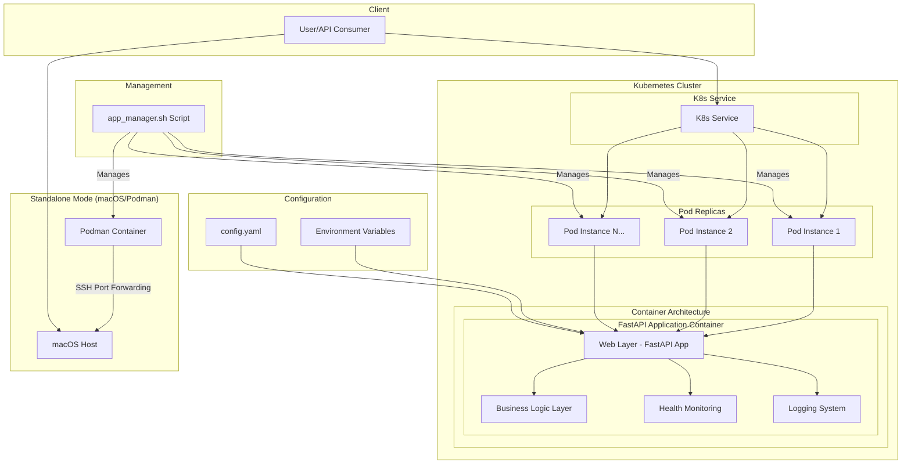
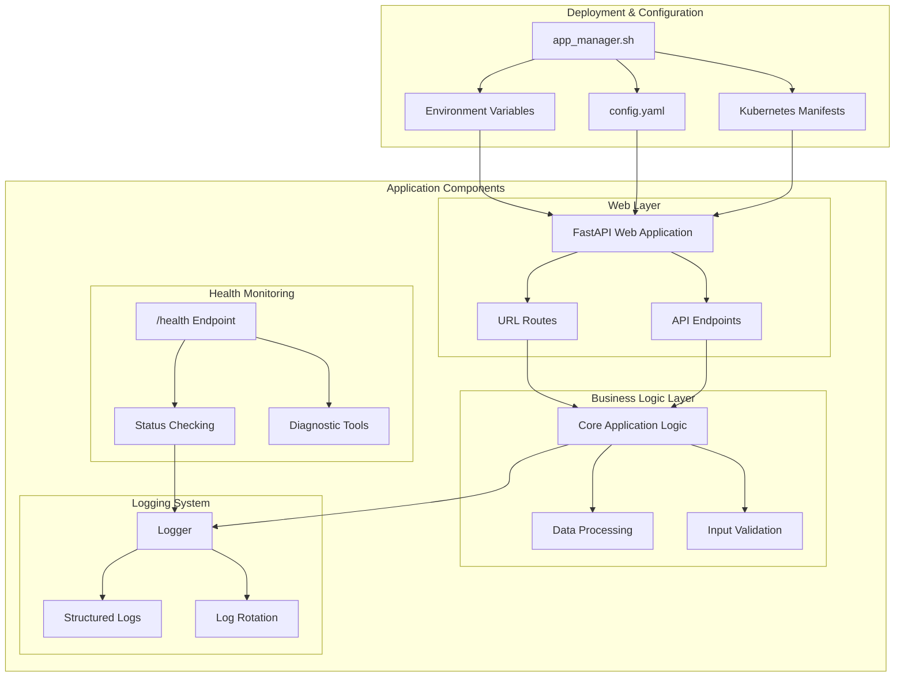

# Architecture Diagrams

These diagrams illustrate the architecture of the K8s Python App.

## High-Level Architecture

```mermaid
graph TD
    subgraph "Client"
        User[User/API Consumer]
    end

    subgraph "Kubernetes Cluster"
        subgraph "K8s Service"
            Service[K8s Service]
        end
        
        subgraph "Pod Replicas"
            Pod1[Pod Instance 1]
            Pod2[Pod Instance 2]
            Pod3[Pod Instance N...]
        end
        
        subgraph "Container Architecture"
            subgraph "FastAPI Application Container"
                FastAPI[Web Layer - FastAPI App] --> BL[Business Logic Layer]
                FastAPI --> Health[Health Monitoring]
                FastAPI --> Log[Logging System]
            end
        end
    end
    
    subgraph "Standalone Mode (macOS/Podman)"
        Podman[Podman Container] --> |SSH Port Forwarding| Mac[macOS Host]
    end
    
    User --> Service
    Service --> Pod1
    Service --> Pod2
    Service --> Pod3
    
    Pod1 --> FastAPI
    Pod2 --> FastAPI
    Pod3 --> FastAPI
    
    User --> Mac
    
    subgraph "Management"
        Script[app_manager.sh Script]
    end
    
    Script --> |Manages| Podman
    Script --> |Manages| Pod1
    Script --> |Manages| Pod2
    Script --> |Manages| Pod3
    
    subgraph "Configuration"
        EnvVars[Environment Variables]
        ConfigFile[config.yaml]
    end
    
    EnvVars --> FastAPI
    ConfigFile --> FastAPI
```

## Detailed Component Architecture

```mermaid
flowchart TD
    subgraph "Application Components"
        subgraph "Web Layer"
            FastAPI[FastAPI Web Application]
            Routes[URL Routes]
            APIEndpoints[API Endpoints]
            
            FastAPI --> Routes
            FastAPI --> APIEndpoints
        end
        
        subgraph "Business Logic Layer"
            CoreLogic[Core Application Logic]
            DataProcessing[Data Processing]
            Validation[Input Validation]
            
            CoreLogic --> DataProcessing
            CoreLogic --> Validation
        end
        
        subgraph "Health Monitoring"
            HealthEndpoint["/health Endpoint"]
            StatusCheck[Status Checking]
            DiagnosticTools[Diagnostic Tools]
            
            HealthEndpoint --> StatusCheck
            HealthEndpoint --> DiagnosticTools
        end
        
        subgraph "Logging System"
            Logger[Logger]
            StructuredLogs[Structured Logs]
            LogRotation[Log Rotation]
            
            Logger --> StructuredLogs
            Logger --> LogRotation
        end
        
        Routes --> CoreLogic
        APIEndpoints --> CoreLogic
        CoreLogic --> Logger
        StatusCheck --> Logger
    end
    
    subgraph "Deployment & Configuration"
        AppManager[app_manager.sh]
        EnvVars[Environment Variables]
        ConfigFile[config.yaml]
        K8sManifests[Kubernetes Manifests]
        
        AppManager --> EnvVars
        AppManager --> ConfigFile
        AppManager --> K8sManifests
    end
    
    EnvVars --> FastAPI
    ConfigFile --> FastAPI
    K8sManifests --> FastAPI
```
